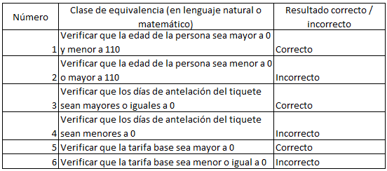

### EJECUTAR LAS PRUEBAS
> ## Revise cuál es la diferencia.
>> * **package:** Compila el proyecto y lo empaqueta
>> * **test:** Ejecuta las pruebas de unidad

### FINALIZAR EL EJERCICIO
> ## Piense en los casos de equivalencia que se pueden generar del ejercicio para la registraduría, dadas las condiciones. Deben ser al menos 5.
>> 1. DEAD: Revisar que la condición isAlive = False lo cual indica que no esta vivo
>> 2. DUPLICATED: Revisar que la condición isAlive = True para corroborar que la persona este viva y despues revisamos que person01.getId = person02.getId lo cual nos muestra con el id de la persona que se esta ingresando ya existe en nuestra lista de personas, lo cual indica que la persona esta duplicada
>> 3. UNDERAGE: Verficamos que la variable getAge < 18 AND getage > 0 que nos muestra que la persona esta por debajo de la edad requerida 
>> 4. VALID: verificamos que la persona este viva, tenga una edad valida y este en una edad apropiada y que no sea no sea una persona duplicada
>> 5. INVALID_AGE: Verificamos que la variable getAge < 0 AND getAge > 120 lo cual nos indica que es una edad invalida

### EJERCICIO "DESCUENTO DE TARIFAS" REALIZAR DISEÑO DE PRUEBAS
> 1. De acuerdo con lo indicado, y teniendo en cuenta que NO hay precondiciones, en qué casos se debería arrojar una excepción de tipo ExcepcionParametrosInvalidos?. Agregue esto a la especificación.
>> * Que la edad del pasajero sea menor a 0 o superior a 110
>> * Que los días de antelación sean menores a 0
>> * Que la tarifa base sea menor o igual a 0

> 2. En la siguiente tabla enumere un conjunto de clases de equivalencia que -según usted- creen una buena división del conjunto de datos de entrada de la función anterior:
>>
>> 

